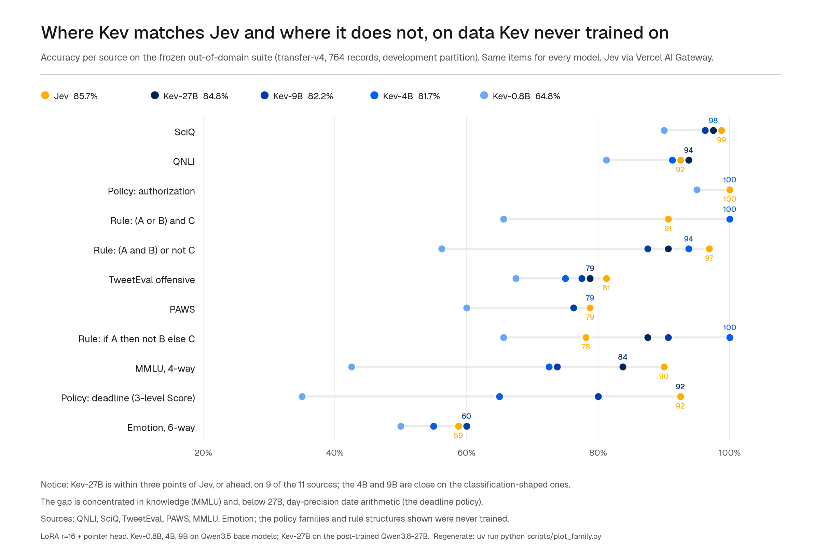

# Kev

Small Jev-like decision models you can train and run yourself.

<p>
  <a href="https://github.com/jaredpalmer/kev/actions/workflows/ci.yml"></a>
  <a href="https://huggingface.co/collections/jaredpalmer/kev-6aad9d0ea49f2589665e07cd"></a>
  <a href="https://huggingface.co/spaces/jaredpalmer/kev"></a>
  <a href="https://huggingface.co/datasets/jaredpalmer/kev-suites"></a>
  <a href="LICENSE"></a>
</p>

Kev is a family of small decision models built on Qwen3.5 and Qwen3.8 and based on the architecture described in [Jev's Architecture Unmasked](https://archerhume.com/posts/jevs-architecture-unmasked). You can use the pretrained weights or train your own. The API matches TypeSafe's [System One](https://docs.typesafe.ai/api), so you can point their Python SDK at your local server.

## Highlights

- Yes/no (`noul`), multiple-choice (`choice`) and rating (`score`) questions in one request. The questions share the text but can't read each other.
- Calibrated probabilities by default: each checkpoint ships with a temperature fitted on held-out data.
- Drop-in for Jev: the TypeSafe Python SDK works against a Kev server unchanged.
- Four sizes, from a 0.8B that runs on a laptop to a 27B for a single data-centre GPU.
- Fine-tune on your own labelled examples. A coding-agent skill runs the whole loop on Modal, from finding your questions to serving the result.
- Deploy your own HTTPS endpoint with one command. It scales to zero when idle.
- Try it in the browser first: [huggingface.co/spaces/jaredpalmer/kev](https://huggingface.co/spaces/jaredpalmer/kev).

## Models

Start with Kev-4B. Move to Kev-9B if you have a bigger GPU, or to Kev-27B if you have an 80 GB GPU and want the most accurate Kev. Use Kev-0.8B when size matters more than accuracy.

| Model | Base | Accuracy: New Sources | Accuracy: Trained Sources | Brier: New Sources | Runs on | Model Card |
|---|---|---|---|---|---|---|
| [Kev-0.8B](https://huggingface.co/jaredpalmer/kev-0.8b) | Qwen3.5-0.8B-Base | 0.648 / 0.697 | 0.827 / 0.838 | 0.481 / 0.416 | Any Apple Silicon Mac, L4 | [Details](docs/model-cards/kev-0.8b.md) |
| [Kev-4B](https://huggingface.co/jaredpalmer/kev-4b) | Qwen3.5-4B-Base | 0.817 / 0.838 | 0.873 / 0.865 | 0.269 / 0.242 | 32 GB Mac, L40S, H100 | [Details](docs/model-cards/kev-4b.md) |
| [Kev-9B](https://huggingface.co/jaredpalmer/kev-9b) | Qwen3.5-9B-Base | 0.822 / 0.852 | 0.872 / 0.874 | 0.286 / 0.237 | 32 GB Mac, L40S, H100 | [Details](docs/model-cards/kev-9b.md) |
| [Kev-27B](https://huggingface.co/jaredpalmer/kev-27b) | Qwen3.8-27B (post-trained) | **0.848 / 0.896** | 0.866 / 0.870 | **0.236 / 0.164** | B200, H200, H100 80 GB | [Details](docs/model-cards/kev-27b.md) |
| Jev | Hosted | 0.857 / – | 0.845 / – | 0.211 / – | TypeSafe's API | – |

Each cell is **development / test**. "New sources" means datasets and policy rules Kev never saw during training. It is the closest thing here to your own questions. "Trained sources" means held-out examples from the datasets Kev was trained on. We pick checkpoints using the development sets and read each test set only once per released model. Jev has only been run on the development sets. Brier scores the whole probability distribution, not just the top answer; lower is better.

On new sources Kev-27B is within a point of Jev (0.848 vs 0.857), and Kev-4B and Kev-9B are within four points. We don't know what Jev was trained on, so this isn't a controlled comparison of the two architectures. [What to Expect](#what-to-expect) says where Kev is as good as Jev and where it isn't.

Kev-0.8B, 4B and 9B start from Qwen base models and share one training recipe. Kev-27B starts from Qwen's post-trained release, and we don't know what that was trained on. Each model card has the full recipe, all results, and the earlier versions kept as Hub tags. The weights are also in the [GitHub release](https://github.com/jaredpalmer/kev/releases/tag/kev-family), with SHA-256 checksums.

## Quick Start

### Try It in the Browser

The [Hugging Face Space](https://huggingface.co/spaces/jaredpalmer/kev) runs Kev-4B and Kev-0.8B, with nothing to install.

### Run It Locally

You'll need Python 3.12 or 3.13 and [uv](https://docs.astral.sh/uv/). The repo's `.python-version` makes `uv sync` use 3.13; torch has no wheels for 3.14 yet.

```bash
git clone https://github.com/jaredpalmer/kev.git && cd kev
uv sync --extra serve
uv run --extra serve python -m kev.serve --run jaredpalmer/kev-4b --port 8009
```

This starts Kev-4B on your machine: CUDA or ROCm if you have a GPU, MLX on Apple Silicon. The first run downloads the adapter and the base model. `--run` also accepts a local checkpoint directory or a Hub revision like `jaredpalmer/kev-4b@qwen3`.

In another terminal, send it a ticket:

```bash
curl -s localhost:8009/v1/systemone -H 'content-type: application/json' -d '{
  "state": "Shoes arrived two weeks late and in the wrong size. Also I see two charges on my card.",
  "model": "kev-latest",
  "questions": {
    "department":  {"type": "choice", "instructions": "Which team should handle this?",
                    "criteria": {"returns": "Exchanges, refunds, wrong or damaged items",
                                 "shipping": "Delivery status, delays, lost packages",
                                 "billing": "Charges, invoices, payment problems"}},
    "escalate":    {"type": "noul",  "instructions": "Does this need urgent human attention?"},
    "frustration": {"type": "score", "instructions": "How frustrated is the customer?",
                    "criteria": ["Calm", "Frustrated", "Very angry"]}
  }}'
```

Example response from Kev-4B, running in bf16 on an Apple M5:

```json
{
  "model": "kev-latest",
  "answers": {
    "department":  { "type": "choice", "choice": "returns", "confidence": 0.21,
                     "probabilities": { "returns": 0.47, "shipping": 0.28, "billing": 0.25 } },
    "escalate":    { "type": "noul", "noul": 0.93 },
    "frustration": { "type": "score", "score": 1.44, "confidence": 0.78,
                     "legend": { "0": "Calm", "1": "Frustrated", "2": "Very angry" },
                     "probabilities": { "0": 0.00, "1": 0.56, "2": 0.44 } }
  },
  "usage": { "input_tokens": 101, "output_tokens": 161 },
  "latency_ms": 495
}
```

The ticket mentions a return, a late delivery and a billing problem, and the department probabilities say so. That's why Kev returns probabilities instead of a single label: your code can route the confident cases and send the rest to a person.

### Use It From Python

If you already call Jev, point your client at Kev and keep the rest of your code. The TypeSafe SDK is included in `uv sync --extra serve`:

```python
from typesafe_sdk import Choice, Noul, Score, TypeSafeClient

client = TypeSafeClient(
    api_key="local",
    base_url="http://127.0.0.1:8009",
    model="kev-latest",
)
response = client.system_one(
    state="I was charged twice. Please fix this ASAP.",
    questions={
        "billing": Noul(instructions="Is this ticket about billing?"),
        "tone": Choice(
            instructions="What is the customer's tone?",
            criteria={"calm": None, "frustrated": None, "angry": None},
        ),
        "urgency": Score(
            instructions="How urgent is this ticket?",
            criteria=["can wait", "this week", "today"],
        ),
    },
)
print(response.nouls["billing"].noul)
print(response.choices["tone"].choice)
print(response.scores["urgency"].score)
```

## Fine-Tune on Your Own Data

The released models were trained on public datasets and generated policy examples. If your questions look different, like your own routing categories, your own escalation rules or another language, a short fine-tune usually helps more than any prompt change. It also fits the temperature to your data, so the confidence you set thresholds on is measured on your own labels.

What to expect: on an example support workload (three questions, 1,050 generated records, 15 minutes on an H100), fine-tuning took Kev-4B from 67.7% to 73.6% accuracy, and from automating 34% of decisions at a 5% error budget to 48% ([details](skills/kev-finetune/README.md#why-fine-tune-at-all)). On real data, one epoch on 5,219 labelled consumer-finance complaints took Kev-4B from 0.804 to 0.904 accuracy on complaints it had never seen. Gains like these are in distribution: they tell you how well Kev learns your task, not how it does on everything else. Size your dataset first. With 400 records, the gain on the example workload was inside the noise.

### With a Coding Agent

```bash
npx skills add jaredpalmer/kev@kev-finetune
```

Then ask your agent to "fine-tune Kev on my support tickets". The [`kev-finetune` skill](skills/kev-finetune/) interviews you, finds the questions your code already asks Jev or TypeSafe, converts the labels you have or generates enough with any LLM to measure a gain, fine-tunes from a released checkpoint on Modal, fits the temperature on a held-out slice, scores the result against the untouched model, deploys an endpoint, and tears everything down at the end. You don't need a local GPU or a clone of this repo. A Kev-4B training run costs about $1 on an H100.

### By Hand

The skill's [README](skills/kev-finetune/README.md) is the same recipe for people: six short standard-library scripts and one Modal app. To train from this repo instead, put your examples in a JSONL file, one request per line. It's the same shape as an API request, plus a `label` on every question:

```jsonl
{"state": {"subject": "Charged twice", "body": "I see two charges for order #4411. Please refund one."},
 "questions": {
   "team":     {"type": "choice", "instructions": "Which team should handle this ticket?",
                "criteria": {"billing": "Payments and refunds", "shipping": "Delivery problems", "access": "Login and account access"}, "label": "billing"},
   "angry":    {"type": "noul",   "instructions": "Is the customer angry?", "label": false},
   "priority": {"type": "score",  "instructions": "How urgent is this ticket?", "criteria": ["low", "normal", "high"], "label": 1}}}
```

For `choice` the label is the option name, for `noul` it's `true` or `false`, and for `score` it's the level's position starting at 0. Keep 10–20% of the file aside for evaluation.

Then start from a released checkpoint with `--init_from`:

```bash
uv run python -m kev.train --data train.jsonl --base Qwen/Qwen3.5-4B-Base --init_from jaredpalmer/kev-4b \
    --epochs 2 --lr 2e-5 --batch 1 --accum 8 --dtype bf16 --checkpointing 1 --device cuda --out runs/mine

uv run python -m kev.benchmark --run runs/mine --data heldout.jsonl --out runs/mine-eval
uv run --extra serve python -m kev.serve --run runs/mine --port 8009
```

`--init_from` loads the adapter and pointer head from the released model before training, so you keep what Kev already knows and add your domain on top. Starting from the base model instead throws that away: in one user's test on 836 support-tool decisions, a fine-tune from the base scored 0.33 on Kev's own evaluation set, against 0.84 for the released model; the same data with `--init_from` kept 0.83 there and reached 0.88 on the new domain. Use a smaller learning rate than the from-scratch recipe (`2e-5` is a good start), and pick `--base` to match the checkpoint you start from; the trainer checks that the base, revision, LoRA rank and head size agree before it loads anything.

`--batch 1 --accum 8` in bf16 fits the 0.8B model on a 4 GB GPU. The benchmark reports accuracy, Brier score and calibration per question type, so you can see which of your questions the fine-tune helped. The checkpoint you started from is recorded in `runs/mine/training_config.json`. On a Mac, run one training job at a time; two jobs on the same Apple GPU are much slower.

## Deploy Your Own Endpoint

To get an HTTPS endpoint instead of a local server, you don't need this repo, just a [Modal](https://modal.com) account:

```bash
pip install modal && modal setup
curl -LO https://raw.githubusercontent.com/jaredpalmer/kev/main/skills/kev-deploy/scripts/kev_serve.py
KEV_API_KEY=$(openssl rand -hex 24) modal deploy kev_serve.py
```

That serves Kev-4B on an L40S at `https://<your-workspace>--kev-api.modal.run`, with the same API as above behind `Authorization: Bearer <key>`. It scales to zero when idle, so an unused endpoint costs nothing. The first request after idle waits about 35 seconds for a container to start. `KEV_MODEL=jaredpalmer/kev-9b` serves another model on the GPU that suits it; Kev-27B goes to a B200, falling back to an H200 or H100. If you use a coding agent, `npx skills add jaredpalmer/kev@kev-deploy` does the same and wires the URL into your code. [skills/kev-deploy](skills/kev-deploy/) has the GPU and cost table.

A model you fine-tuned with the `kev-finetune` skill deploys the same way from its own Modal app (`KEV_SERVE_SECRET=kev-serve-key KEV_SERVE_RUN=<run> modal deploy scripts/kev_modal.py`; see [its deploy guide](skills/kev-finetune/references/deploy.md)). To host Kev on your own machines instead, run `kev.serve` from [Run It Locally](#run-it-locally) on a GPU box and put it behind your own proxy; [Serving Performance](#serving-performance) says which GPU to pick.

## What to Expect

**Accuracy.** Kev-27B is within three points of Jev, or ahead of it, on 9 of the 11 new-source categories in the chart below. Kev-4B and Kev-9B are about as close on classification-shaped sources like routing, entailment and science questions. All of them trail on knowledge questions, which depend mostly on the base model (MMLU: Kev-9B 0.74, Kev-27B 0.84, Jev 0.90), and the smaller models also trail on day-precision date arithmetic.



**Confidence.** Each checkpoint ships with a fitted temperature, so its probabilities are calibrated by default. As served, Kev-9B puts at least 0.9 probability on a wrong answer for 4.0% of new-source questions, against Jev's 3.7%. Jev still ranks its answers better: at a 5% error budget, Kev can automate 0.45–0.57 of decisions and Jev 0.70. Check a threshold on your own data before you rely on it.

**Speed.** Kev-4B answers six questions about a new short text in 18.1 ms of model time on an H100 and 41.5 ms on an L40S, and a container serves around 101 requests per second on an H100. On an Apple M5, Kev-4B takes 721 ms for five questions, or 136 ms when the text repeats and comes from the cache. [Serving Performance](#serving-performance) has every GPU and batch size.

**Length.** Training used states of up to 384 tokens. The server accepts 8,192 tokens for the state and 8,192 for each question. Longer inputs work, but accuracy drops on long documents. Kev-27B holds up much better: on a panel of questions buried in 1k–6k tokens of unrelated text it scores 0.833, against Kev-9B's 0.556.

## Playground

With the server running, open another terminal. You'll need Node 20.9+:

```bash
cd playground
npm install
npm run dev -- -p 3001
```

Open [localhost:3001](http://localhost:3001), load a preset, and edit the text and questions. Press `⌘↵` to run it. "Packed vs separate" compares asking all questions at once with asking them one at a time. "Permute" runs a Choice question with six option orders. There are also presets for testing question isolation and fake delimiter tokens.


There's a [chess demo](http://localhost:3001/chess), too. The board is the input, legal moves are Choice options, and a Score question rates the position. You can play against Kev or let it play itself. Games are saved in `localStorage`.

## API

### `POST /v1/systemone`

`state` is the text to evaluate. Each question has instructions and, where needed, a set of answers to choose from.

```jsonc
{
  "state": "…",                          // string | object | array — the content to evaluate
  "model": "kev-latest",
  "questions": {
    "<id>": {                            // you choose the id; the model never sees it
      "type": "noul" | "choice" | "score",
      "instructions": "…",               // string | object | array, optional
      "criteria": …                      // noul: {true?, false?}  choice: {option: description|null}  score: [level, …]
    }
  }
}
```

| Type | Criteria | Answer |
|---|---|---|
| `noul` | Optional descriptions for `true` and `false` | `noul`: probability of yes |
| `choice` | 1–255 option names, each with a description or `null` | `choice`: most likely option; `probabilities` and `confidence` |
| `score` | 1–255 descriptions, ordered from lowest to highest | `score`: mean level index, starting at 0; `legend`, `probabilities`, and `confidence` |

For Choice with `K > 1` options, confidence is `(p_max − 1/K) / (1 − 1/K)`. A single option has confidence 1. Score confidence measures how close the distribution is to its most likely level. It's an approximation of TypeSafe's formula, which isn't public. Neither field is a measured accuracy rate.

Objects and arrays are converted to labeled text. Delimiter-like strings in user input are escaped before tokenization. Invalid requests return `422`. `usage.output_tokens` counts tokens in the serialized answers, not generated tokens. In score answers, `legend` echoes the criteria levels verbatim with their original JSON types.

| Method | Path | Purpose |
|---|---|---|
| `GET` | `/v1/models` | Model cards (`name`, `description`, `release_date`) plus the loaded checkpoint's details |
| `POST` | `/v1/systemone/permute` | Run one Choice question with different option orders (`n_perm` 1 to 64, default 6) |
| `POST` | `/v1/systemone/separate` | Run each question in its own forward pass |

A request may carry any number of questions. The server runs them a token budget at a time (one maximal row of 16,384 tokens per forward pass, counting the cached document once per question in that pass), so memory does not grow with the question count and the answers do not depend on the split. Every response carries an `x-typesafe-request-id` header. The server binds to `127.0.0.1` and is open by default; set `KEV_API_KEY` to require `Authorization: Bearer <key>` on `/v1/*`, as the TypeSafe clients always send it.

| Variable | Effect |
|---|---|
| `KEV_TEMPERATURE=1.0` | Return raw probabilities instead of the calibrated ones |
| `KEV_DATE_FACTS=1` | Append the number of days between any two dates in the state (see [Benchmarks](#benchmarks)) |
| `KEV_DTYPE=fp32` | Serve the exact fp32 path the evaluations use (bf16 is the default on GPUs) |
| `KEV_API_KEY` | Require a bearer key |
| `MODELSCOPE_ENDPOINT` | Base URL the `KEV_BASE_HUB=modelscope` base loads pull from (the ModelScope SDK's standard variable); overrides the default mirror `https://ms.sc4.ai:10443`. Point it at an in-cluster cache so scale-out replicas warm from the cache instead of any remote origin |
| `MODELSCOPE_DOMAIN` | Same as `MODELSCOPE_ENDPOINT` but the SDK's deprecated form; a bare domain is upgraded to `https://` (`MODELSCOPE_ENDPOINT` wins when both are set) |

## How It Works

Each checkpoint is a rank-16 LoRA adapter and a small pointer head on a Qwen base model. On an attention-only base (Qwen3), the state and questions go into one token sequence:

```text
<state> …state…
<q> instructions <opt> option 1 </opt> <opt> option 2 </opt> … <decide>
<q> instructions <opt> option 1 </opt> <opt> option 2 </opt> … <decide>
```

The attention mask lets a token read the state and its own question, but not other questions or future tokens. Each question's position IDs restart just after the state. This lets the model process the state once and answer each question independently.

Qwen3.5 and Qwen3.8 mix attention layers with Gated DeltaNet layers, which are recurrent and ignore attention masks. For those models, which is every current Kev, each question runs as its own row: the state followed by that question, with the same positions as above. The rows are independent, so isolation is exact, and the server computes the state once and reuses its cache for every row. On attention-only models the two forms give identical probabilities (`tests/test_model.py`).

Kev-27B uses the same design on `Qwen/Qwen3.8-27B`, with two differences. Its base is Qwen's post-trained release rather than a `-Base` checkpoint, and we don't know what it was post-trained on. And its frozen weights are held in bf16 (`--weights_dtype bf16`), because fp32 weights don't fit next to the optimizer on one GPU. It therefore serves in bf16 only, with 55 GB of weights (about 66 GB resident with the serving buffers), which is why it needs an 80 GB card and has no Mac path. Serving folds the adapter into those bf16 weights, as for the other Kevs; its served probabilities stay within 0.009 of the evaluation path on an H200 (`runs/fused-27b-h200`).

The pointer head scores each option's `</opt>` hidden state against the question's `<decide>` hidden state. A softmax turns those scores into probabilities. Because `<decide>` comes last, it can attend to the full option list.

Training uses cross-entropy on the correct answer. The adapter and head are trained together; the rest of the base weights stay fixed. Training examples and API requests use the same text format. No Jev outputs were used for training.

Asking questions together or separately produces probabilities within 4e-6 in the fp32 tests. This does **not** mean option order is irrelevant: options within a question can still affect one another. See [the model code](kev/model.py) and [parity tests](tests/test_model.py).

## Training

The released models share one base training set, `decision-v7`: 10,000 examples from ten public datasets, 896 generated policy examples, and 1,680 examples from 60 generated rule structures. Kev-0.8B, 4B and 9B train on it for two epochs with LoRA rank 16 and cross-entropy. The learning rate is `1e-4` for 0.8B and `5e-5` for 4B and 9B. On these hybrid bases the adapter covers the attention, MLP and DeltaNet projections; `kev.train` picks the right targets from the model config.

Kev-0.8B, 4B and 9B then get short follow-up fine-tunes from their released checkpoints, through the same `--init_from` path you'd use for your own data: generated cases that state day counts or have the deciding evidence removed (all three), then real documents and generated skill data (4B and 0.8B). Kev-27B trains in a single one-epoch run on one H200 (learning rate `5e-5`, the same adapter targets): Kev-9B's data, plus 1,400 records with a question buried in 1k–6k tokens of unrelated text, and soft targets instead of one-hot labels on records whose answer is genuinely ambiguous. The buried-question records target long documents, where it holds up much better than the smaller models. The model cards list every stage with its data and cost.

```bash
# sanity run, ~1 minute
uv run python -m kev.train --n_per_source 40 --accum 4 --out runs/smoke

# the first stage of Kev-0.8B (~20 min on one H100; the Mac path works but is slow for Qwen3.5 bases)
uv run python -m kev.train --suite evals/v7/decision-v7 --base Qwen/Qwen3.5-0.8B-Base --base_revision dc7cdfe2ee4154fa7e30f5b51ca41bfa40174e68 \
    --epochs 2 --lr 1e-4 --batch 8 --dtype bf16 --p_none_pair 0.25 --device cuda --out runs/kev-0.8b

# the first stage of Kev-4B (one H100 via Modal, ~1 h; see below). Swap in Qwen/Qwen3-4B-Base for the previous generation.
uv run python -m kev.train --suite evals/v7/decision-v7 --base Qwen/Qwen3.5-4B-Base --base_revision 1001bb4d826a52d1f399e183466143f4da7b741b \
    --epochs 2 --lr 5e-5 --batch 4 --accum 2 --dtype bf16 --checkpointing 1 --p_none_pair 0.25 --device cuda --out runs/kev-4b
```

Use `uv run python -m kev.train --help` for all training options. The released models don't use the optional `--perm_kl` or `--ord_w` losses. [PLAN.md](PLAN.md) records what was tried, what helped, and what didn't.

### Modal

Each trial gets its own H100. The study keeps running if you disconnect, and you can download the results when it finishes:

```bash
uv run modal token new                                    # once; opens the browser
KEV_GPU=T4 uv run modal run modal_app.py::smoke           # end-to-end check, ~1 minute of GPU

uv run modal deploy modal_app.py                          # once; studies run on the deployed app and survive disconnects
uv run modal run modal_app.py::study \
    --suite evals/v7/decision-v7 --plan experiments/v7-final.json \
    --name my-study --transfer evals/v4/transfer-v4 --budget 30 --timeout 7200
uv run modal run modal_app.py::pull --name my-study       # results -> runs/my-study, ranked
```

[Study plans](experiments/v7-final.json) list training settings. Each trial saves the settings, code hashes, dataset hashes, and results. Choose models using the development results, not the locked test. After choosing a final candidate, you can read its test results once:

```bash
uv run modal run modal_app.py::locked_test --trial my-study/00-trial-0 --name my-candidate   # one read, ever
```

## Benchmarks

The evaluation data under `evals/` is frozen: dataset versions and file checksums are recorded in each manifest. Large files are downloaded from [the Hub mirror](https://huggingface.co/datasets/jaredpalmer/kev-suites) and checked against those hashes. Every model in the tables above is scored on the same items. The numbers in this README and the model cards are checked in CI against the committed reports they come from (`docs/claims.json`, `uv run python scripts/verify_claims.py`).

| Suite | What it measures |
|---|---|
| `decision-v7` | Held-out examples from the ten training datasets, the generated policies and the rule structures ("trained sources") |
| `transfer-v4` | 764 records from datasets and policy and rule types Kev never trained on: QNLI, SciQ, PAWS, MMLU, Emotion, TweetEval, held-out policies and rules ("new sources") |
| `transfer-v9` | `transfer-v4` plus 10-way MMLU-Pro, records buried in unrelated text, and "unknowable" records whose deciding evidence was removed |

```bash
uv run python -m kev.benchmark --run jaredpalmer/kev-4b --suite evals/v4/transfer-v4 --out runs/my-eval      # new sources
uv run python -m kev.benchmark --run jaredpalmer/kev-4b --suite evals/v9/transfer-v9 --out runs/my-eval-v9   # + MMLU-Pro, buried states, unknowable items
uv run python -m kev.benchmark --run jaredpalmer/kev-4b --suite evals/v7/decision-v7 --out runs/my-eval-id   # trained sources
uv run python -m kev.benchmark --remote http://127.0.0.1:8009 --suite evals/v4/transfer-v4 --out runs/my-remote   # any System One endpoint, Jev included
```

These commands use development data. Test data requires `--allow-test`. The benchmark reports accuracy, Brier score, calibration error, the share of decisions you could automate at a 5% error budget, option-order changes, and question isolation. On the unknowable records it reports how often the model still answers with at least 0.9 confidence (Kev-9B 0%, Jev 9%). Published accuracy numbers use fp32 evaluation, not the bf16 serving path. `kev.jev` runs the same questions against Jev through Vercel AI Gateway, and `kev.compare` compares two saved runs with paired bootstrap confidence intervals.

**Calibration.** Each checkpoint stores a temperature (Kev-27B 1.38, Kev-9B 2.30, Kev-4B 2.41, Kev-0.8B 2.35) fitted on its in-distribution development set, and the pointer head applies it when the model is loaded. It never changes which answer wins. On new sources it takes Kev-9B's calibration error from 0.106 to 0.042 and its confident errors (wrong answers with probability ≥ 0.9) from 8.7% to 4.0%, about Jev's 3.7%. The accuracy numbers above are the same either way; the Brier numbers are for the raw probabilities. `scripts/calibrate_checkpoint.py` also reports an out-of-fold estimate, so the in-sample fit can be checked against records it didn't see.

**Dates.** Kev can't subtract dates reliably, but it can use a day count it's given. `KEV_DATE_FACTS=1` appends one sentence per pair of dates in the state ("June 26, 2026 is 8 days before July 4, 2026"). On the deadline policy questions this takes Kev-9B from 0.80 to 0.90 (Jev 0.93). None of the tables use it.

**Other people's test sets.** `evals/external/` holds test sets from other projects, converted to this format, with their published live Jev results. [SemIf](https://github.com/TheoLeeCJ/SemIf) uses the last two to compare its own models, and they are rebuilt from the same hash-verified sources with `scripts/freeze_semif_external.py`. Some were scored on earlier versions of the Kev weights, which the Kev column names.

| Suite | What it is | Jev | Kev |
|---|---|---|---|
| [SemIf](https://github.com/TheoLeeCJ/SemIf) | 144 authored decisions | 0.965 | 0.917 (Kev-9B at `v7-base`) |
| [scienthoon](https://github.com/scienthoon/jev-ood-calibration) | 900 support tickets, routing / tone | 0.897 / 0.914 | 0.952 / 0.911 (Kev-9B at `v7-base`) |
| `wanli-v1` | 256 WANLI test pairs: supported, insufficient or contradicted | 0.758 | 0.703 (Kev-9B), 0.695 (Kev-4B at `night2-du-release`) |
| `typesafe-v1` | The 102 public evals.typesafe.ai questions over 20 cases: agreement / distance on the 89 that fit | 0.891 / 0.125 | 0.809 / 0.226 (Kev-9B), 0.856 / 0.231 (Kev-4B at `night2-du-release`) |

Kev trails Jev on WANLI and TypeSafe's evals. SemIf reports 0.637 balanced accuracy on WANLI for untrained Qwen3.5-4B. TypeSafe's cases are scored the way SemIf scores them (`scripts/compare_typesafe.py`): agreement with the reference answer and total-variation distance to the reference distribution, averaged within each case and then over cases. The published TypeSafe answers score 0.883 / 0.127 on the same rows. The documents are long, and 13 of them exceed the 8,192-token serving context; counting those as wrong, Kev-9B scores 0.728 / 0.304 and Kev-4B 0.770 / 0.308 over all 102. Document length explains part of the gap: Kev-9B answers 0.92 of the 26 documents inside its 384-token training context and 0.75 to 0.79 of the longer ones (Kev-4B 0.88, then 0.81 to 0.88).

## Serving Performance

Pick the GPU by the model:

| Model | GPU ($/h) | 6 questions, short text | 5 questions, 2,200-token text | Requests/s, 64 clients |
|---|---|---|---|---|
| Kev-0.8B | L4 (0.80) | 22.7 / 16.1 ms | 108.6 / 32.3 ms | 62.8 |
| Kev-4B | L40S (1.95) | 41.5 / 27.7 ms | 145.2 / 43.0 ms | 51.4 |
| Kev-4B | H100 (3.95) | 18.1 / 12.9 ms | 89.4 / 22.5 ms | 100.8 |
| Kev-9B | L40S (1.95) | 66.4 / 42.7 ms | 235.6 / 57.5 ms | 32.7 |
| Kev-9B | H100 (3.95) | 24.0 / 16.6 ms | 88.5 / 26.4 ms | 79.5 |
| Kev-27B | B200 (6.25) | 46.5 / 32.2 ms | 178.0 / 52.1 ms | 44.2 |
| Kev-27B | H200 (4.54) | 65.5 / 48.0 ms | 267.9 / 71.9 ms | 30.3 |
| Kev-27B | H100 (3.95) | 75.0 / 52.0 ms | 277.5 / 79.3 ms | 28.9 |

Times are model time per request (the `latency_ms` the API returns), median of 20, for a new text / the same text again. The server caches the text, so asking more questions about a document you've already sent only pays for the questions. Requests per second are for 64 concurrent clients sending six questions about a new short text each; the server batches them. Network time is extra: about 65 ms per round trip through a Modal web endpoint in the same region.

An L4 is enough for Kev-0.8B but too slow for Kev-4B. The A100 is slower than the L40S here and costs more. Kev-9B needs about 17 GB of GPU memory and Kev-27B 55 GB of weights (about 66 GB with the batching buffers); under load Kev-27B is compute-bound, and a B200, H200 or H100 costs about the same per request. On CUDA, install `flash-linear-attention` for the Qwen3.5 models (`kev_serve.py` and the Modal images already do).

On Apple Silicon, `uv sync --extra serve` installs [MLX](https://github.com/ml-explore/mlx-lm) and the server uses it automatically. Five questions about a ~270-token text on an M5 (32 GB):

| Model | New text | Same text again |
|---|---|---|
| Kev-0.8B | 149 ms | 28 ms |
| Kev-4B | 721 ms | 136 ms |

The server runs in bf16 on GPUs and Macs. Its probabilities differ from the fp32 path the published evaluations use by at most about 0.03 on a GPU and 0.05 on a Mac, and the top answer changes on about one question in 300. Set `KEV_DTYPE=fp32` for the exact path. `/v1/models` reports the backend and precision in use. `uv run modal run modal_app.py::serving --run jaredpalmer/kev-4b --gpu L40S --name <name>` measures a row of the table on your own account (the rows above: `runs/serve-*`, `runs/grouping-4b-h100`, `runs/fused-27b-*`).

## Limitations

- Calibration is a single temperature fitted in distribution. It can't reorder confidences, so the share of decisions you can automate at a 5% error budget (0.45–0.57) is still below Jev's 0.70. Test a probability threshold on your own data before you rely on it.
- Knowledge questions are set by the base model. MMLU is 0.74 for Kev-9B against Jev's 0.90, and MMLU-Pro 0.52 against 0.84.
- Fine-tuning can make the base model worse at individual tasks. Date arithmetic was the clearest case ([issue #8](https://github.com/jaredpalmer/kev/issues/8)); training on stated day counts plus `KEV_DATE_FACTS=1` recovers it.
- Changing option order can change an answer. Question isolation doesn't prevent this.
- Training used at most 384 state tokens and 1,024 tokens for the state plus one question. Serving allows 8,192 of each; longer context wasn't covered by training.
- On a Mac, answers take hundreds of milliseconds, not tens. Kev-27B needs an 80 GB GPU and has no Mac path.
- Kev-27B starts from a post-trained model whose training data we don't know.

## Development

```bash
uv run --extra serve python -m pytest tests/test_unit.py tests/test_research.py tests/test_generators.py tests/test_conventions.py \
    tests/test_documents_tools.py tests/test_hard_v1.py tests/test_devtools_v1.py tests/test_breadth_v1.py tests/test_rounds.py -q   # no weights, no server; what CI runs
KEV_BASE_URL=http://127.0.0.1:8009 uv run --extra serve python -m pytest tests/test_api.py -q   # against a running server
cd playground && npm run lint && npx next typegen && npx tsc --noEmit -p .
```

The API tests run TypeSafe's example requests and the official SDK against your local server. [PLAN.md](PLAN.md) is the research plan: what we have learned, the rules every experiment follows, and one line per round. The full log (every experiment, the criteria set before it ran, and how it came out) is at the git tag `research-archive-2026-09-24`.

<details>
<summary>Previous generation (Qwen3) and the prototype</summary>

The first Kev family used Qwen3 bases with the same data and settings. Those weights stay published and run on plain PyTorch on a Mac, but they are no longer developed.

| Model | Base | Accuracy: Trained Sources | Accuracy: New Sources | Brier: New Sources | Model Card |
|---|---|---|---|---|---|
| Kev-0.6B (Qwen3) — `jaredpalmer/kev-0.6b` | Qwen3-0.6B-Base | 0.801 / 0.808 | 0.620 / 0.642 | 0.536 / 0.483 | [Details](docs/model-cards/kev-0.6b-qwen3.md) |
| Kev-4B (Qwen3) — `jaredpalmer/kev-4b@qwen3` | Qwen3-4B-Base | 0.854 / 0.856 | 0.790 / 0.806 | 0.328 / 0.294 | [Details](docs/model-cards/kev-4b-qwen3.md) |
| Kev-8B (Qwen3) — `jaredpalmer/kev-8b` | Qwen3-8B-Base | 0.863 / 0.870 | 0.796 / 0.780 | 0.337 / 0.327 | [Details](docs/model-cards/kev-8b-qwen3.md) |

The original [Kev-0.5B](https://huggingface.co/jaredpalmer/kev-0.5b) used Qwen2.5-0.5B and is kept for reference; see its [model card](docs/model-cards/kev-0.5b.md).

</details>

<details>
<summary>Troubleshooting</summary>

- If MPS runs out of memory during training, check that you're running only one job. Don't enable `output_hidden_states` or add tokens with peft's `trainable_token_indices`; both have caused memory problems here.
- If the playground loads but buttons don't work, use `localhost:3001`. Next.js checks development hostnames. Other hosts need an entry in `allowedDevOrigins` in `playground/next.config.ts`.
- If dataset loading reports `Dataset scripts are no longer supported`, use `legacy-datasets/banking77`. This repo already uses it.

</details>

## Authors

- Jared Palmer ([@jaredpalmer](https://github.com/jaredpalmer))

Built with [Devin](https://devin.ai). Thanks to [Archer Hume](https://archerhume.com/posts/jevs-architecture-unmasked) for the architecture write-up, [TypeSafe](https://docs.typesafe.ai/api) for the API design, [Qwen](https://huggingface.co/Qwen/Qwen3.5-9B-Base) for the base models, [3x3xX3N0N](https://github.com/jaredpalmer/kev/issues/8) for showing where the date-arithmetic failure really is, and [Radexito](https://github.com/Radexito) for `--init_from`.

Related work: [Hydragen](https://arxiv.org/abs/2402.05099), [DeFT](https://arxiv.org/abs/2404.00242), [FIRST](https://arxiv.org/abs/2406.15657).

## License

[Apache-2.0](LICENSE). The Qwen3, Qwen3.5 and Qwen3.8 base models are also Apache-2.0. Training datasets have their own licenses; see the [model cards](docs/model-cards/).
